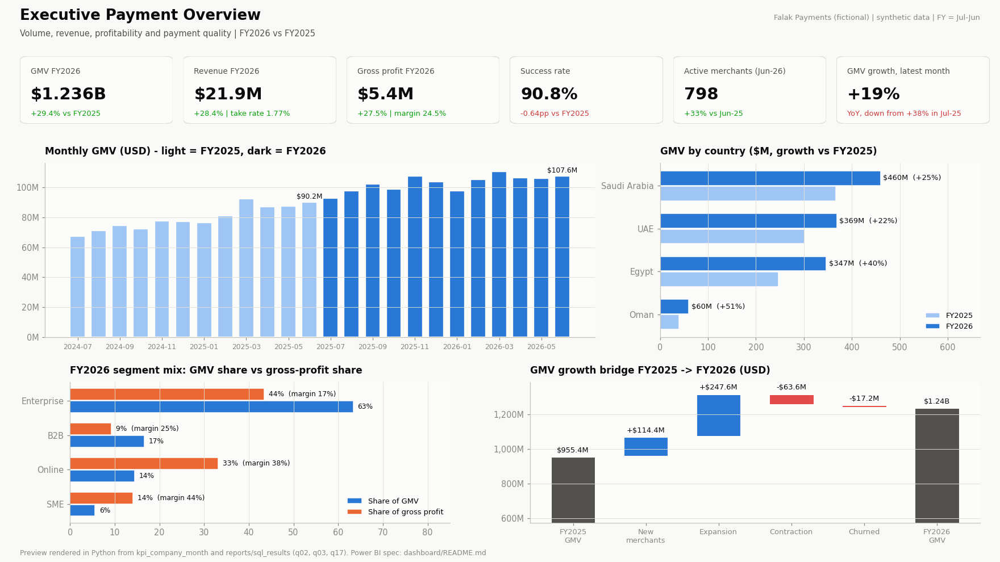
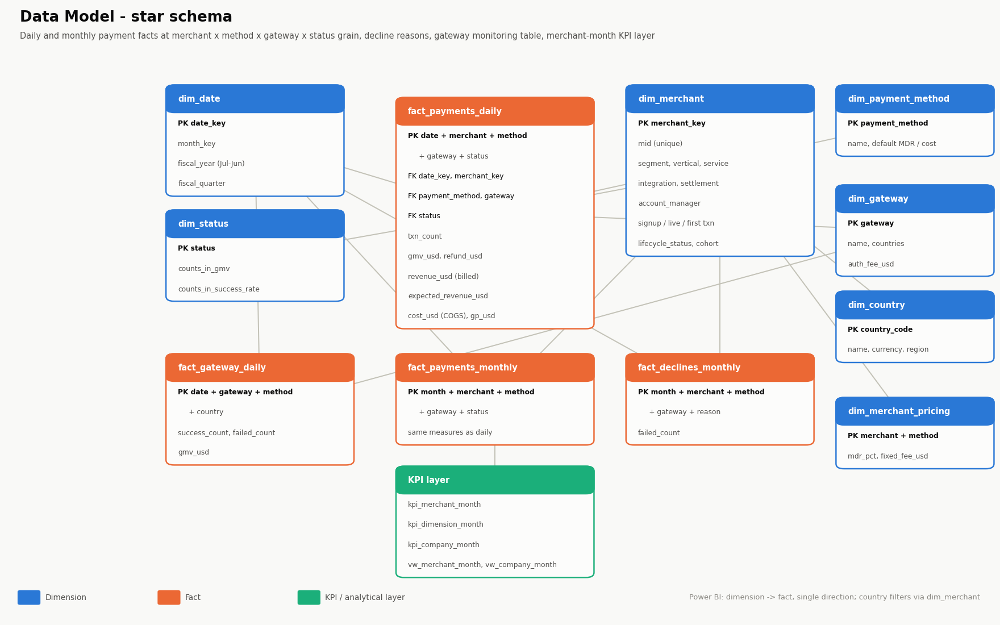
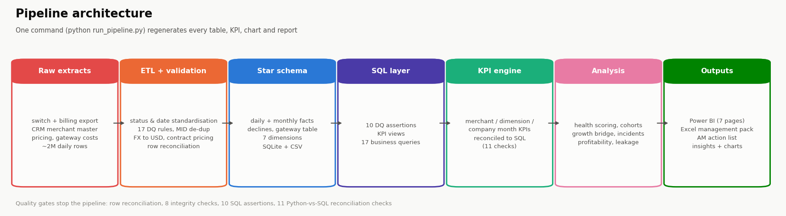
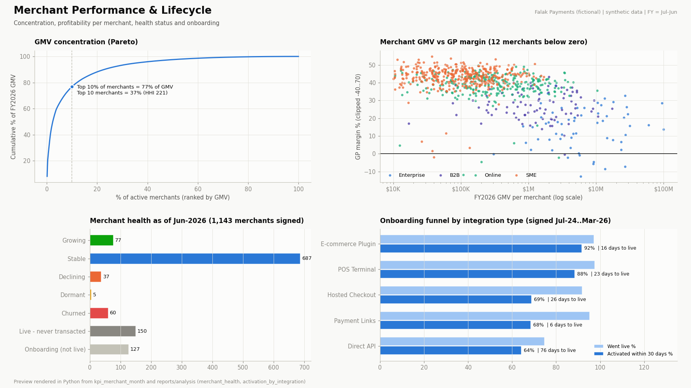
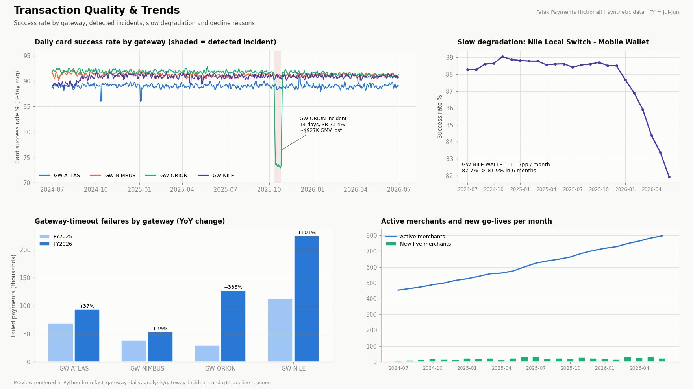
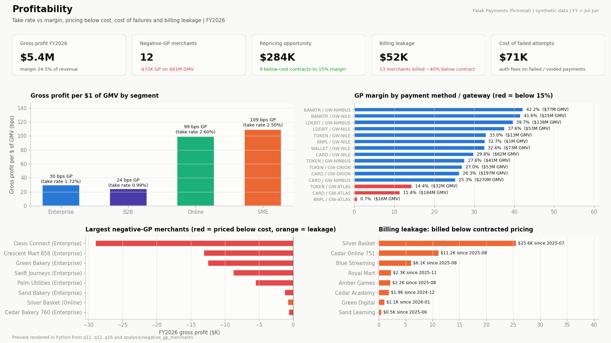

# Payment & Merchant Performance Analytics

**Merchant and payment analytics for a multi-country payment service provider. The project takes ~2M rows of daily switch
and billing data and answers two questions: which merchants make money, why payments fail, and where revenue leaks.**


> **Portfolio project on synthetic data.** *Falak Payments* is a fictional company. No real merchant, transaction or
> employer data is used anywhere in this repository.



**In 30 seconds**
* **Scale:** 1,143 merchants in **Egypt, KSA, UAE and Oman**, across 4 segments, 6 payment methods and 4 gateways. It covers
  24 months with a July-June fiscal year: **~2M daily rows and $2.2B GMV**.
* **Pipeline:** one command, `python run_pipeline.py`, runs everything:
  * ETL with 17 data-quality rules and a star schema
  * 17 business SQL queries
  * a KPI engine reconciled against SQL
  * merchant health scoring, cohorts, growth bridge
  * **automatic gateway-incident detection** and **billing-leakage reconciliation**
  * charts, an Excel pack and an **account-manager action list**
* **Headline findings:**
  * FY2026 GMV grew **+29%**, but growth slowed from 38% to 19% because **four Enterprise merchants** are moving volume away.
  * **Enterprise is 63% of GMV but only 44% of gross profit.**
  * **9 contracts are priced below cost** (a $284K repricing opportunity).
  * **13 merchants are billed ~40% below contract.**
  * A **two-week gateway incident** cost an estimated **$1.2M GMV**.

---

## Contents
[1 Business Problem](#1-business-problem) · [2 Objective](#2-project-objective) · [3 Business Questions](#3-business-questions) ·
[4 Dataset](#4-dataset) · [5 Data Model](#5-data-model) · [6 Pipeline](#6-data-pipeline) · [7 Technologies](#7-technologies) ·
[8 KPIs](#8-kpi-definitions) · [9 SQL](#9-sql-analysis) · [10 Python](#10-python-analysis) · [11 Dashboard](#11-dashboard) ·
[12 Insights](#12-key-insights) · [13 Recommendations](#13-business-recommendations) · [14 Data Quality](#14-data-quality) ·
[15 Structure](#15-repository-structure) · [16 How to Run](#16-how-to-run) · [17 Future Improvements](#17-future-improvements) ·
[18 CV](#18-how-this-project-supports-my-cv) · [19 Disclaimer](#19-disclaimer)

---

## 1. Business Problem

Falak Payments processes card, local-debit, wallet, BNPL and bank-transfer payments for merchants in four markets. GMV is
growing, but leadership has no reliable answers to five questions:

* **Is growth healthy?** Is it broad-based, or dependent on a few large merchants?
* **Which merchants and segments actually make money?** Negotiated Enterprise pricing might cost more than it earns.
* **Why do payments fail?** Merchants complain about success rates, but nobody can separate issuer declines from gateway problems.
* **Is the company billing what it contracted?**
* **Where does onboarding stall?** Many merchants sign and never become active.

The data is typical of a payments company: a daily switch and billing export with inconsistent status labels, a CRM merchant
master with duplicate MIDs and missing fields, contracted pricing in a separate table, and four local currencies.

## 2. Project Objective

Build a reproducible payments analytics product that:
* turns raw switch, billing and CRM extracts into a **validated, reconciled star schema**;
* calculates **volume, revenue, profitability, payment-quality and merchant-lifecycle KPIs** consistently in Python and SQL;
* **detects gateway incidents and slow degradation**, and estimates the GMV lost;
* **reconciles billed revenue against contracted pricing** to find leakage;
* delivers a **7-page Power BI dashboard**, an Excel management pack and a **weekly action list per account manager**.

## 3. Business Questions

| # | Question | Where |
|---|---|---|
| 1 | Total GMV, revenue, gross profit, success and failure rate? | `q01`, Page 1 |
| 2 | Which merchants generate the highest GMV, and the highest GP? | `q05`, `q06`, Page 2 |
| 3 | Which segments are growing? Which countries contribute most? | `q02`, `q03`, Pages 3-4 |
| 4 | Which verticals have the highest transaction volume? | `q04`, Page 4 |
| 5 | Which merchants have declining activity? Which became inactive? | `q07`, `q08`, merchant_health |
| 6 | What is merchant activation performance? | `q09`, `q10`, Page 5 |
| 7 | What is the relationship between GMV and revenue? | `q11`, Page 6 |
| 8 | What is the profitability by merchant, method and gateway? | `q06`, `q12`, Page 6 |
| 9 | What are the main payment performance issues? | `q13`, `q14`, incident detection, Page 7 |
| 10 | Where is revenue leaking against contracted pricing? | `q16`, DQ-B01 |
| 11 | Where did growth come from: new merchants, expansion, contraction or churn? | `q17`, growth bridge |
| 12 | Which verticals carry refund exposure? | `q15` |

## 4. Dataset

Generated by `python/generate_data.py`. It is seeded, so every run is identical.

| Item | Value |
|---|---|
| Period | Jul-2024 to Jun-2026 (FY2025, FY2026) |
| Merchants | 1,143 signed (888 ever transacted); 454 → 798 monthly active |
| Countries / currencies | Egypt (EGP), Saudi Arabia (SAR), UAE (AED), Oman (OMR); reporting in USD |
| Segments / services | Enterprise, SME, Online, B2B / Online Checkout, POS, Payment Links, Subscriptions, B2B Collections |
| Payment methods / gateways | Card, Local Debit, Mobile Wallet, Tokenized Mobile Pay, BNPL, Instant Bank Transfer / 4 fictional gateways |
| Daily fact | 1,963,217 raw rows → 1,948,174 clean (about 79M transactions) |
| Statuses | Success, Failed, Refunded, Voided (+ label variants and impossible statuses in raw) |

**Behaviours simulated.** The analysis has to *find* these from the data; it never reads the generator's settings.
* Merchant lifecycle: signup → go-live → first transaction, with integration-dependent delays and drop-off.
* Growth, decline and churn trajectories, including a few large merchants shifting volume away.
* Seasonality: White Friday, summer travel, back-to-school, Ramadan.
* Gateway reliability: one sustained incident and one slow degradation.
* Negotiated Enterprise pricing, sometimes below cost.
* A billing-configuration error affecting a set of merchants.
* About 0.5% injected data defects.

Small committed samples are in `data/sample/`. The full dataset regenerates in about 2 minutes.

## 5. Data Model



| Type | Tables |
|---|---|
| Dimensions | `dim_date` (fiscal calendar), `dim_merchant`, `dim_payment_method`, `dim_gateway`, `dim_country`, `dim_status`, `dim_merchant_pricing` |
| Facts | `fact_payments_daily` (date × merchant × method × gateway × status), `fact_payments_monthly`, `fact_declines_monthly`, `fact_gateway_daily` |
| KPI layer | `kpi_merchant_month`, `kpi_dimension_month`, `kpi_company_month` + SQL views `vw_merchant_month`, `vw_company_month`, `vw_dimension_month` |

Design choices:
* **GMV counts only successful payments.** Refunds are tracked separately (net GMV), and failed and voided attempts carry
  cost but no revenue.
* **Two revenue columns:** `revenue_usd` (billed) and `expected_revenue_usd` (contract × volume). The difference is billing leakage.
* **Fiscal calendar** (July-June) in `dim_date`, used by every FY comparison.
* **A monthly fact** feeds Power BI, while the 2M-row daily fact stays in the pipeline (git-ignored).

Full definitions: [`docs/data_dictionary.md`](docs/data_dictionary.md).

## 6. Data Pipeline



| Step | Script | What it does |
|---|---|---|
| 1 | `generate_data.py` | Writes 7 raw extracts with realistic defects |
| 2 | `etl.py` + `validation.py` | Maps status labels; merges duplicate MIDs; imputes missing country from the account manager's market; fixes impossible go-live dates; applies 17 DQ rules; converts FX to USD; calculates expected revenue from contracts; **reconciles raw = clean + quarantine + duplicates** |
| 3 | `database.py` + `sql/01-03` | Builds SQLite and runs **10 in-database assertions** (GMV only on success, revenue ≤ GMV, GP identity, monthly = daily, no activity before go-live …) |
| 4 | `sql/04` | Runs 17 business queries, saved to `reports/sql_results/` |
| 5 | `kpi_engine.py` | Merchant, dimension and company-month KPIs, **reconciled with SQL on 11 checks** |
| 6 | `analysis.py` | Health scoring, cohorts, growth bridge, incident detection, degradation trend, concentration, profitability root causes, activation |
| 7 | `visuals.py`, `reporting.py` | README charts, Excel management pack, account-manager action list, KPI summary |

## 7. Technologies

| Area | Tools |
|---|---|
| ETL, KPI engine, analysis | Python 3.11: pandas, numpy |
| Database & SQL | SQLite (CTEs, window functions, conditional aggregation, `WINDOW` clauses) |
| BI | Power BI (spec, 48 DAX measures incl. fiscal-year time intelligence) |
| Reporting automation | openpyxl: formatted workbooks, conditional formatting, per-owner sheets |
| Quality | Declarative DQ rule engine, SQL assertions, Python↔SQL reconciliation, unittest |

## 8. KPI Definitions

| KPI | Definition |
|---|---|
| GMV · Net GMV | Successful payment value · GMV − refunds |
| Transactions · AOV | Successful transactions · GMV ÷ transactions |
| Revenue · Take rate | Billed MDR + fixed fees · Revenue ÷ GMV |
| COGS · GP · GP margin | Interchange / scheme / gateway cost incl. fees on failed attempts · Revenue − COGS · GP ÷ revenue |
| Success / failure rate | Successful ÷ (successful + failed) · 1 − success rate |
| Refund rate | Refunds ÷ GMV |
| Active / new / activated merchants | ≥ 1 successful payment in period · went live in period · first success within 30 days of go-live |
| Merchant / GMV / revenue / GP growth | vs prior period (MoM, YoY, FY-over-FY) |
| Billing leakage | Contracted revenue − billed revenue |
| Net GMV retention | (Prior-year GMV + expansion − contraction − churn) ÷ prior-year GMV |

Full list, lifecycle states and analytical rules: [`docs/kpi_definitions.md`](docs/kpi_definitions.md).

## 9. SQL Analysis

| File | Content |
|---|---|
| [`01_schema.sql`](sql/01_schema.sql) | Star-schema DDL with keys, CHECK constraints and indexes |
| [`02_cleaning.sql`](sql/02_cleaning.sql) | 10 data-quality assertions inside the database |
| [`03_kpi_analysis.sql`](sql/03_kpi_analysis.sql) | Merchant-month, company-month and dimension-month KPI views (MoM, YoY via `LAG(…,12)`, 3M moving average, FYTD, ranks) |
| [`04_business_analysis.sql`](sql/04_business_analysis.sql) | **17 named queries, one per business question** |

Example: a merchant cohort retention query that only reports a retention point once every merchant in the cohort is old
enough to have reached it (`q10`):

```sql
WITH cohort AS (
    SELECT merchant_key,
           strftime('%Y', live_date) || '-Q' || ((CAST(strftime('%m', live_date) AS INTEGER) + 2) / 3) AS live_quarter,
           CAST(strftime('%Y', live_date) AS INTEGER) * 12 + CAST(strftime('%m', live_date) AS INTEGER) AS live_idx
      FROM dim_merchant WHERE live_date >= '2024-07-01' AND first_txn_date IS NOT NULL
),
maturity AS (SELECT live_quarter, (2026 * 12 + 6) - MAX(live_idx) AS months_observed FROM cohort GROUP BY live_quarter)
SELECT c.live_quarter, COUNT(DISTINCT c.merchant_key) AS cohort_size,
       CASE WHEN mt.months_observed >= 12
            THEN ROUND(100.0 * COUNT(DISTINCT CASE WHEN a.months_since_live = 12 THEN a.merchant_key END)
                       / COUNT(DISTINCT c.merchant_key), 1) END AS m12_active_pct
  ...
```

Techniques used:
* CTE pipelines; window functions (`LAG` incl. 12-month lag, `RANK`, `DENSE_RANK`, running and moving windows, named `WINDOW`)
* Pareto cumulative share; conditional aggregation; CASE-based growth-bridge classification
* Cohort maturity masking; contract-vs-billed reconciliation; long-format `UNION ALL` dimension views

## 10. Python Analysis

* **Validation engine:** declarative rules (FIX / DROP / QUARANTINE / FLAG). Every quarantined row keeps the IDs of the rules
  it failed.
* **Merchant health scoring:** Growing, Stable, Declining, Dormant, Churned, never transacted, plus six alert flags per merchant.
* **Gateway incident detection:** robust z-score (median/MAD) of daily success rate against a trailing 28-day baseline.
  Episodes are grouped, then **excess failures, lost GMV and lost revenue** are estimated.
* **Slow-degradation detection:** 6-month slope of the monthly success rate, which catches what daily anomaly detection misses.
* **Growth bridge:** new, expansion, contraction and churn, by segment. **Cohort retention matrix.**
* **Concentration:** top-10 and top-10% share, and HHI, for both GMV and GP.
* **Profitability root cause:** loss-making merchants are classified as *priced below cost* or *billing leakage*, with a
  repricing what-if.
* **Reporting automation:** a 10-sheet Excel management pack and an **account-manager action list** with one sheet per owner,
  prioritized by GMV at stake and with recommended actions.

## 11. Dashboard

A 7-page Power BI report. The full build spec, relationships, 48 DAX measures and theme are in [`dashboard/`](dashboard/README.md).

| Page | Purpose |
|---|---|
| 1 Executive Payment Overview | GMV, revenue, GP, success rate, active merchants, growth bridge |
| 2 Merchant Performance | Merchant table, Pareto, GMV vs margin scatter, Merchant Profile drill-through |
| 3 Country Performance | USD vs local-currency growth, country × segment matrix |
| 4 Segment & Vertical | Growth and GP per $ by segment; vertical volume and success rate |
| 5 Merchant Lifecycle | Onboarding funnel, cohort heatmap, health status |
| 6 Profitability | GP bps by segment, method × gateway margin, negative-GP merchants, billing leakage |
| 7 Transaction Quality | Daily success rate vs baseline, incidents, degradation, decline reasons |

> The images are **previews rendered in Python from the same tables Power BI uses**. Real Power BI screenshots replace
> them after the build (`dashboard/README.md §5`).





## 12. Key Insights

The full write-up, with FACT / INTERPRETATION / RECOMMENDATION and source files, is in
[`insights/business_insights.md`](insights/business_insights.md).

| # | Finding |
|---|---|
| 1 | **GMV +29% to $1.24B, but YoY growth slowed from 38% to 19%.** Four Enterprise merchants cutting volume by 32-47% explain 82% of the decline. Without them, recent growth is +33%. |
| 2 | **Enterprise is 63% of GMV but 44% of GP.** It earns 30 bps per $ of GMV, against 99-109 bps for Online and SME. |
| 3 | **12 merchants are GP-negative.** 9 contracts are priced below processing cost, including a top-10 merchant at −7% margin. Repricing them to a 15% margin = **+$284K GP**. |
| 4 | **Billing leakage:** 13 merchants are billed ~40% below contract ($52K) because of a pricing-configuration error. |
| 5 | **Gateway incident** (GW-ORION, 12-25 Oct 2025): card success rate fell to 73% against 92%, with ~63K extra failures and **~$1.2M GMV lost**. It was detected automatically. |
| 6 | **Slow degradation:** GW-NILE wallet success rate fell from 87.7% to 81.9% in 6 months. Only trend monitoring catches it. |
| 7 | **Onboarding:** Direct API takes a median of 76 days to go live, and 25% never do. 20% of Payment-Links merchants never transact. |
| 8 | **Net GMV retention is ~117%.** Expansion (+$248M) outweighs contraction (−$64M) and churn (−$17M). |
| 9 | **Egypt grows +46% in local currency against +40% in USD**, and Oman grows fastest (+51%) at the thinnest margin. |
| 10 | **Failed attempts cost $71K in fees.** Travel and e-commerce carry 5-6% refund rates. |

## 13. Business Recommendations

1. **Run a key-account retention program for the top 25 merchants**, with weekly GMV-trend monitoring.
2. **Set targets on gross profit, not just GMV.** Focus acquisition on Online and SME.
3. **Add a deal-desk price floor** (cost + 15%) and reprice the 9 below-cost contracts. Route card volume away from the high-cost gateway.
4. **Reconcile billed revenue against contracts every month.** Fix the 13 configurations and recover arrears.
5. **Monitor success rate in real time with automatic failover.** Claim the October SLA credits.
6. **Add trend-based monitoring** next to daily anomaly alerts. Escalate the GW-NILE wallet decline.
7. **Give API integrations a support track** and run an activation playbook for Payment-Links merchants.
8. **Use the account-manager action list** (284 flagged merchants) as the weekly commercial working list.

## 14. Data Quality

| Gate | Result |
|---|---|
| Row reconciliation | 1,963,217 raw = 1,948,174 clean + 7,177 quarantined + 7,866 duplicates ✅ |
| Merchant master | 6 duplicate MIDs merged · 4 missing countries imputed · 11 missing verticals · 5 go-live-before-signup and 3 go-live-after-first-transaction dates fixed |
| Transaction rules | Invalid dates, unknown MIDs, impossible statuses, negative amounts, zero counts, revenue > GMV quarantined · GP recomputed on 1,961 rows |
| Integrity checks (Python) | 8 / 8 pass |
| SQL assertions | 10 / 10 pass |
| Python ↔ SQL reconciliation | 11 / 11 checks pass (GMV, revenue, GP, transactions, active flags, ranks, company KPIs) |
| Tests | 9 / 9 pass, including: every injected defect is caught, the billing-leakage merchants are found without false positives, and the October incident is detected |

The full report regenerates at `data/processed/dq_report.md`.

## 15. Repository Structure

```
payment-merchant-performance-analytics/
├── README.md  run_pipeline.py  requirements.txt  .gitignore  LICENSE
├── config/config.yaml               # pricing, costs, lifecycle rules, thresholds
├── data/
│   ├── raw/                         # generated extracts (git-ignored)
│   ├── processed/                   # star schema + KPI layer (daily fact & .db git-ignored)
│   └── sample/                      # committed samples
├── sql/  01_schema · 02_cleaning · 03_kpi_analysis · 04_business_analysis
├── python/  generate_data · etl · validation · database · kpi_engine · analysis · visuals · reporting · utils
├── tests/                           # unit + integration tests
├── dashboard/                       # Power BI spec, DAX measures, theme
├── images/                          # README visuals (rendered from pipeline outputs)
├── insights/                        # business_insights.md + auto kpi_summary.md
├── reports/                         # sql_results/, analysis/, Excel pack, AM action list
└── docs/                            # data dictionary, KPI definitions
```

## 16. How to Run

```bash
git clone https://github.com/mostafahalafawi/payment-merchant-performance-analytics.git
cd payment-merchant-performance-analytics
python -m venv .venv && source .venv/bin/activate        # Windows: .venv\Scripts\activate
pip install -r requirements.txt

python run_pipeline.py                     # ~2 minutes; regenerates everything
python -m unittest discover -s tests -v    # or: pytest
```

Pricing, costs, lifecycle definitions and alert thresholds live in `config/config.yaml`. To explore the data, open
`data/processed/payments_analytics.db` in DB Browser for SQLite or DBeaver. To build the dashboard, follow `dashboard/README.md`.

## 17. Future Improvements

* **Chargebacks and fraud:** add dispute data to measure chargeback rate and risk-rule precision.
* **Settlement analytics:** settlement timeliness and float by settlement type, plus a settlement-reconciliation report.
* **Smart-routing simulation:** estimate the GP and success-rate impact of routing each merchant to the best gateway.
* **Streaming monitoring:** move incident detection to hourly data with alerting (e.g. Slack or email).
* **Forecasting:** a merchant-level GMV forecast to set account-manager targets.
* **dbt + PostgreSQL:** port the SQL views to dbt models with tests and schedule the pipeline.

## 18. How This Project Supports My CV

| CV skill | Demonstrated by |
|---|---|
| **Payment analytics** | GMV, take rate, success / failure / refund rates, decline reasons, gateway and method performance |
| **B2B payments & merchant performance** | Merchant health scoring, B2B collections segment, account-manager action list |
| **SQL** | 17 business queries, KPI views, 10 in-database assertions (CTEs, window functions, cohorts, Pareto) |
| **Python & automation** | Modular pipeline, config-driven rules, automated Excel reporting per account manager |
| **ETL & data pipelines** | 2M-row multi-currency switch and billing export to a star schema with row reconciliation |
| **Data validation** | 17-rule DQ engine, MID de-duplication, SQL assertions, Python↔SQL reconciliation |
| **Root cause analysis** | Incident vs degradation vs issuer declines; negative-GP root cause; growth deceleration traced to specific accounts |
| **KPI tracking & performance analysis** | Merchant, segment, country and gateway KPIs with MoM, YoY and FYTD |
| **Power BI & executive dashboards** | 7-page spec, 48 DAX measures, fiscal-year time intelligence, drill-through |
| **Multi-country reporting** | Egypt, KSA, UAE, Oman; constant-currency growth |
| **Settlement & operations reporting** | Settlement type attribute, billing reconciliation, operations alerting |

### Suggested CV Project Entry

**Payment & Merchant Performance Analytics** (Portfolio project, synthetic data) · Python · SQL · Power BI · ETL
* Built a payments analytics pipeline for a simulated 4-market payment service provider (1,143 merchants, ~2M daily
  switch/billing rows, $2.2B GMV). It covers Python ETL with a 17-rule data-quality engine, a SQLite star schema,
  17 business SQL queries and a 7-page Power BI dashboard spec.
* Developed merchant health scoring, cohort retention, a GMV growth bridge and robust-statistics gateway-incident
  detection. It flagged a 14-day outage (an estimated $1.2M of GMV lost) and a slow wallet degradation that daily alerts missed.
* Reconciled billed revenue against contracted pricing and ran merchant-level profitability. It surfaced 13 under-billed
  merchants and 9 below-cost contracts (a $284K GP repricing opportunity), and automated a per-account-manager action list
  covering 284 merchants.

## 19. Disclaimer

All data in this repository is **synthetic**, generated by `python/generate_data.py`. Falak Payments, its merchants,
gateways and account managers are fictional. Any resemblance to real companies or people is coincidental. Pricing,
costs, exchange rates and success rates are illustrative. The project contains **no data, code or confidential
information from any employer**, and its results are analytical demonstrations, not real business outcomes.

---

**Author:** Mostafa Halafawi · Senior Data & Performance Analyst ·
[LinkedIn](https://www.linkedin.com/in/mostafahalafawi) · [GitHub](https://github.com/mostafahalafawi)
